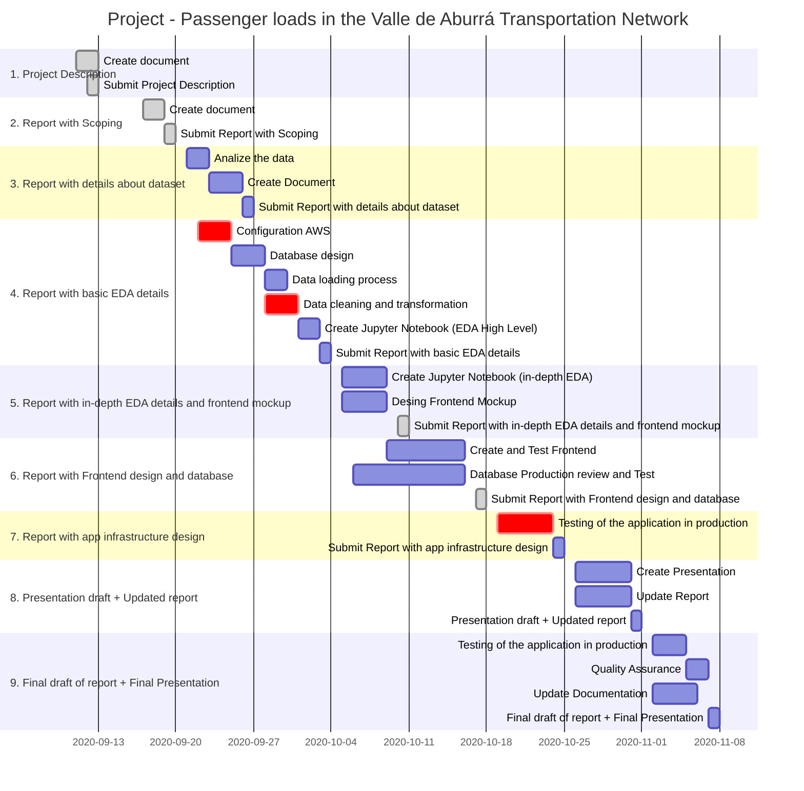

# Analyzing Passenger Loads in The Valle de Aburrá Transportation Network
### Área Metropolitana Del Valle De Aburrá
**Project Team No 21**

Members: Sandra Ruiz, Christian Velez, Felipe Garcia, Boris Martinez, Sebastian Marin, Carlos Taimal, Jorge Saavedra.

## 1. Overview of the industry

 
Big cities around the world face the problem of optimization of their public transport systems. Public entities have to deal with a complex situation where it converges diverse variables like the growth of the city, number of routes, number of passengers, number of buses, number of stops, schedules, etc. in order to balance demand and supply efficiently. Nowadays, thanks to the capacity to register huge amounts of data about the transport services in real-time, and the increasing computational capacity to process big chunks of data we can use Data Science methodologies that allows us to understand, analyze and visualize these complex systems and therefore improve their planning and management.

## 2. Business Impact

 
The planning of public transportation services is one of the most important areas of city planning. This allows to generate an accurate offer to the passengers without increasing operational costs nor generate traffic jam in the important avenues. With the information on the number of passengers on each route and each point in the city, transportation planning policies can be designed to benefit the community in terms of saving travel time or optimizing transportation routes to expand the coverage of the transportation network.

## 3. Specific Problem

 
The Área Metropolitana del Valle de Aburrá Area seeks to identify high demand patterns in order to implement strategies that improve the competitiveness of public transportation.

 
The entity wants to measure the passenger demand in the transportation network of Valle de Aburrá Region, particularly, the passenger load in each road network's arc. The expected results must be able to be filtered by date (time of the day, day of the week, or in general, a time interval) and by route, so that way it is easier to observe the demand levels for the public transportation service through space and time parameters.

 
The methods to reach the result will be georeferenced data analysis, finding through heat maps where the highest passenger density occurs and eventually and with the proper algorithm use the stations' data to find the nearest arc and then associate that demand in order to properly allocate the public transportation resources.

## 4. Data Description

 
The data given by the stakeholder (Area Metropolitana del Valle de Aburra) is stored in CSV and KML files.
The CSV files have the historical data captured and transmitted by the GPS’s installed on each vehicle. There are 3850 vehicles linked to this system transmitting data each 3 minutes approximately. The dataset for this project has the following fields:

|        **FIELD**    |**TYPE** |                                    **DESCRIPTION**                                |
|:------------------- |:------- |:--------------------------------------------------------------------------------- |
| SECUENCIARECORRIDO  | INTEGER | Primary key that identifies the track for a vehicle                               |
| RECORRIDOFINALIZADO | INTEGER | Complete / incomplete flag (S/N)                                                  |
| IDVEHICULO          | INTEGER | unique identifier for a vehicle                                                   |
| CODIGORUTA          | STRING  | unique identifier for a track, each of these identifiers are related to a KML file|
| FECHAREGISTRO       | DATE    | date and time when the data was recorded                                          |
| LATITUD             | FLOAT   | The latitude where passengers board/alight the vehicle*                           |
| LONGITUD            | FLOAT   | The longitude where passengers board/alight the vehicle*                          |
| SUBENDELANTERA      | INTEGER | Quantity of passengers that board the vehicle through the front door              |
| SUBENTRASERA        | INTEGER | Quantity of passengers that board the vehicle through the back door               |
| BAJANDELANTERA      | INTEGER | Quantity of passengers that alight the vehicle through the front door             |
| BAJANTRASERA        | INTEGER | Quantity of passengers that alight the vehicle through the back door              |

* The latitude and longitude coordinates are displayed in the WGS84 standard.

 

We also have the data of the number of passengers who board the bus, either by the entrance or exit door. Each event is georeferenced with the information of the bus GPS and the route they are doing.

Exploring the data, we found a well-structured dataset, this data correspond to November 2019 and some months of 2020 with approximately 3 million records by month. The data related to nodes and arcs have been requested to the stakeholder, after we get that new data it will be possible to group up the values from the first dataset to a specific arc and calculate the passenger load for it.

## 5. Methods

### 5.1. Visualizations

The project’s central axis is through a dashboard, visualize the demand behavior for each transportation network arc; thus, can be identified concepts such as,

1. Histogram to determine the passenger demand according to the selected variables
2. Maps to determine the incidence and density of vehicles and possible groups of interest
3. Identify the possible routes where may be an overcrowding of passengers
4. Trend plots that allow us to find the hours and vehicles most susceptible to being overcrowded, this in case the entity provides us with information about the vehicles
5. Trend plots that allow us to find the days of the week where the demand is highest as well as the overflow
6. Establish nodes with higher demand and supply according to different variables

### 5.2. Modeling

We are currently reviewing the available literature on the subject, some of the models that could be implemented are

1. Time series to model daily passenger demand (methodology to adjust to be defined)
2. Unsupervised classification algorithm to determine groups of vehicles in certain arcs and hours of the day, this if it is possible to obtain additional information about the vehicles

## 6. Interface

 
We are currently developing this point

## 7. Concerns
After the meeting held this past week with the stakeholders and some other discussions with the team members, we have the following concerns:
 * The data that we have been provided is incomplete.  This may affect the accuracy in the visualization results.
 * We don’t exactly know what would be the best predictive models to implement in the context of our project.
 * There is little time for the project execution.

 
In order to address the concerns mentioned above we have organized a github repository and making subgroups to assign to the different tasks we have been identifying. Aside from searching for papers and methodologies about predictive models in transportation contexts, we have asked the T.A’s if they have further information based on their experience in this field.

## 8. Milestones
We intend to achieve two versions of the project, which are the following:

 

1. Perform the processes of data transformation incorporating algorithms for the association of geographic coordinates and showing the descriptive results of the data according to the request of the entity.
   
2. Incorporate models for predicting passenger demand in accordance with the methodologies used for this purpose and taking into account data availability.

## 9. Timelines
The following is a high level schedule of the project development.

